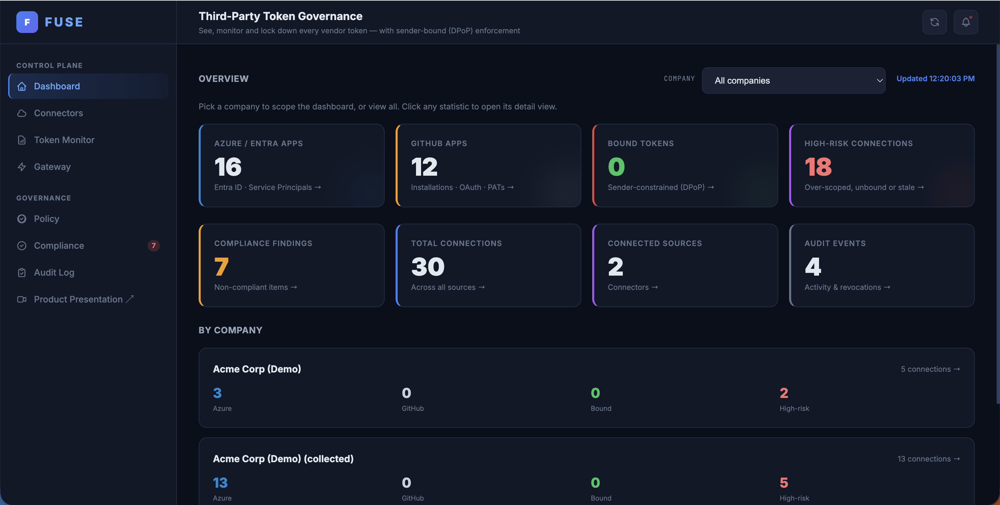
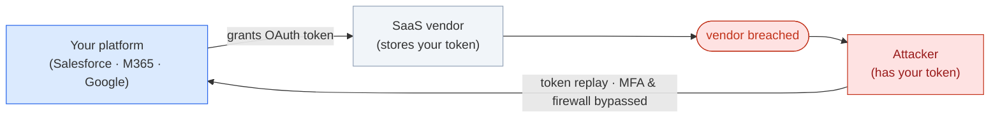
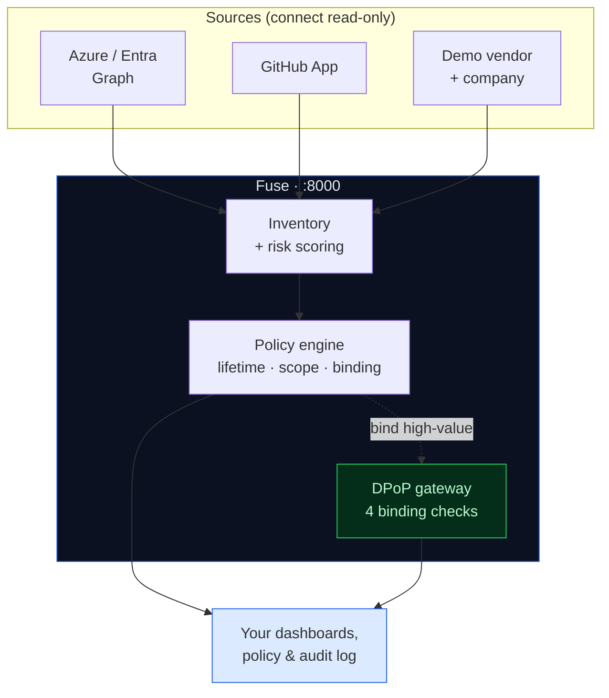
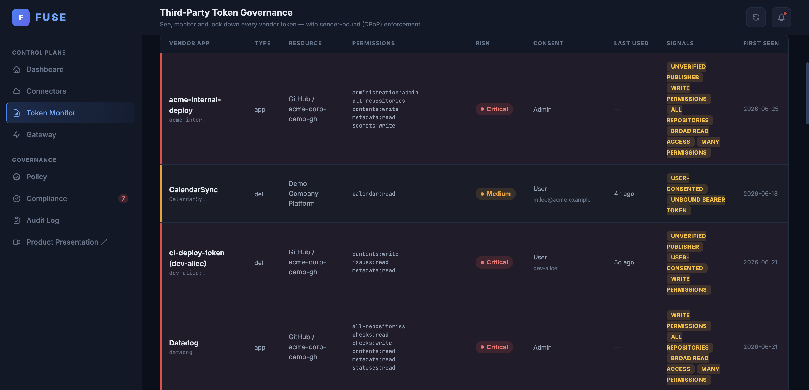
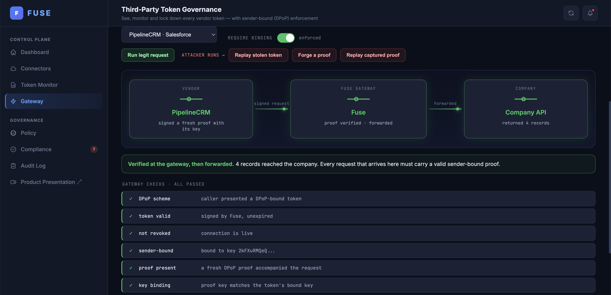
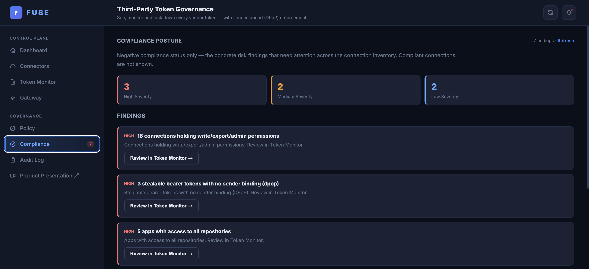

# Fuse

A local demo of third-party token governance — visibility, policy, and cryptographic binding for OAuth tokens your SaaS vendors hold.



## The problem

When you grant a SaaS vendor an OAuth token, they store it. Those tokens are usually **long-lived bearer tokens** — usable by anyone who holds the string. If the vendor is breached, the attacker replays that token straight against your APIs, **bypassing MFA and your firewall**, because the token is proof that authentication already happened and nothing flags it as stolen. The breach window is as long as the token's lifetime — often months.



Identity providers (Okta, Entra) don't help here — they secure human *login*. These are machine-to-machine tokens a vendor holds, with no human in the loop.

### This is not hypothetical

- **Salesloft / Drift (Aug 2025)** — attackers ([UNC6395](https://cloud.google.com/blog/topics/threat-intelligence/data-theft-salesforce-instances-via-salesloft-drift)) stole OAuth tokens from the Drift integration and replayed them across **700+ organizations'** Salesforce (and Google Workspace) tenants to harvest secrets — AWS keys, Snowflake tokens, passwords. ([The Hacker News](https://thehackernews.com/2025/09/salesloft-takes-drift-offline-after.html))
- **Okta support-system breach (Oct 2023)** — session tokens lifted from uploaded HAR files were replayed to hijack admin sessions at **BeyondTrust, 1Password and Cloudflare**. ([BeyondTrust disclosure](https://www.beyondtrust.com/blog/entry/okta-support-unit-breach) · [Cloudflare write-up](https://blog.cloudflare.com/how-cloudflare-mitigated-yet-another-okta-compromise/))
- **Microsoft "Midnight Blizzard" (Jan 2024)** — a legacy **OAuth application** with elevated access was abused to read senior leadership's corporate mailboxes. ([Microsoft MSRC](https://www.microsoft.com/en-us/msrc/blog/2024/01/microsoft-actions-following-attack-by-nation-state-actor-midnight-blizzard) · [response guidance](https://www.microsoft.com/en-us/security/blog/2024/01/25/midnight-blizzard-guidance-for-responders-on-nation-state-attack/))

In every case the credential was *legitimately issued* — the platform saw a valid token and let it through.

## The solution

Fuse reduces the damage in three tiers. The first two need nothing from any vendor, so you get value on day one; the third is reserved for the connections worth the effort.

**1. Visibility** — inventory every token you've granted: scope, age, last used, who consented, whether the publisher is verified, and a risk score. Most orgs can't answer "what can our vendors reach right now, and how do I cut one off?" — Fuse answers it immediately. *(→ Token Monitor, Dashboard)*

**2. Policy** — set token lifetimes and allowed scopes per connection or per company, and revoke on demand. Short lifetimes cut the useful window from months to minutes; revoke kills a connection on the spot (and where Fuse can't cut at source, it links you straight to the provider's revoke screen). *(→ Policy, Compliance)*

**3. Cryptographic binding (DPoP)** — for high-value connections, tie the token to a private key that **never leaves the vendor's machine** ([RFC 9449](https://datatracker.ietf.org/doc/html/rfc9449)). On every call the vendor sends a freshly signed proof; the gateway runs four checks — **token valid · key thumbprint matches · request matches · proof is fresh & unreplayed**. A stolen token without the matching key is rejected. *(→ Gateway)*



### How binding stops a replay

```mermaid
sequenceDiagram
    participant V as Vendor
    participant F as Fuse Gateway
    participant C as Company API
    participant A as Attacker

    Note over V: holds token + private_key
    V->>+F: request + DPoP proof (signed with key)
    Note over F: token valid · key thumbprint · request match · freshness
    F->>C: forwarded
    C-->>-V: 200 OK

    Note over A: has stolen token, no key
    A->>+F: request + stolen token
    Note over F: proof missing or key mismatch
    F-->>-A: 401 Blocked
```

## The console

**Token Monitor** — every grant, app install and token across your sources, risk-scored (Critical → Low) from scope breadth, publisher trust, consent and activity. Click any row for the full detail.



**Gateway** — the inline DPoP demo. The legitimate vendor call is forwarded; the three attacker runs (stolen token, forged proof, replayed proof) are blocked at the gateway, with each binding check shown.



**Compliance** — the non-compliant findings across the inventory, ranked by severity, each linking to the affected connections.



## Run locally

```bash
python3 -m venv .venv
source .venv/bin/activate
pip install -r requirements.txt
./run.sh
```

Three services start: Fuse on `:8000`, a mock company API on `:8010`, a mock vendor on `:8020`. Open **http://localhost:8000**.

The console ships with pre-seeded demo data. Use Connectors → ⚡ Quick-connect demo to wire up the mock vendor and company and fill the inventory immediately. You can also connect a real Azure tenant or GitHub App — see Connect real sources below.

**Load demo data:** Connectors → ⚡ Quick-connect demo. Wires the mock vendor and company together and seeds the grant inventory.

**Explore DPoP:** Gateway tab — run the legitimate vendor call (passes), then the three attacker runs (stolen token / forged proof / replayed proof — all blocked).

**Browse the inventory:** Token Monitor → click any row for risk signals, consent chain, compliance checklist, and revoke.

> State is in-memory. A restart resets everything and regenerates the signing key.

## Connect real sources

**GitHub App** — create a GitHub App (Settings → Developer settings → GitHub Apps) with Metadata: read permissions, generate a private key (.pem), and install it. In Connectors → Add a Source → GitHub, enter the App ID, the .pem contents, and optionally the installation ID and org login.

**Azure / Entra** — register an app in Entra, add application Graph permissions (`Application.Read.All`, `Directory.Read.All`), grant admin consent, and create a client secret. In Connectors → Add a Source → Azure, enter the Tenant ID, Client ID, and client secret.

## Code layout

| Folder | What it does | Port |
|---|---|---|
| `fuse/` | Console + API | 8000 |
| `company_api/` | Mock data platform | 8010 |
| `vendor/` | Mock vendor — holds keys, signs DPoP proofs | 8020 |
| `connectors/` | Connector adapters (demo, GitHub, Azure) | — |
| `common/` | Crypto primitives: EC keys, DPoP, JWK, JWTs | — |
| `web/` | Grant inventory, risk logic, demo seed data | — |
| `collector/` | MS Graph / GitHub data collection | — |

## What's real and what isn't

**Real:** all the crypto — DPoP proofs and the four binding checks, `private_key_jwt` client auth, JWT signing, GitHub App JWTs, Azure client-credentials flows. When you connect a real GitHub App or Azure tenant, the data collected and the revocation calls are real too.

**Simplified:** the quick-connect demo uses a mock vendor and seeded grant data; Fuse's signing key lives in memory; one vendor service stands in for many real ones; Fuse plays the attacker role in the gateway demo.

## Limitations

- Single worker, in-memory — a restart resets all state
- No auth on the console
- DPoP binding only covers connections where the vendor has adopted it; the rest fall back to visibility and policy
