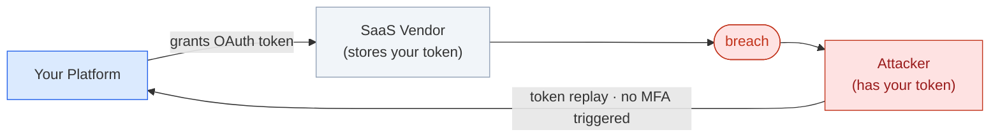

# Fuse

A local demo of third-party token governance — visibility, policy, and cryptographic binding for OAuth tokens your SaaS vendors hold.

## The problem

When you grant a SaaS vendor an OAuth token, they store it. If they're breached, the attacker can replay that token against your APIs — bypassing MFA and firewalls, because the token was legitimately issued and nothing flags it as stolen.



## Three ways to reduce the damage

**1. Visibility** — see every token you've granted: scope, age, last used, who consented, whether the publisher is verified. Most orgs don't have this picture.

**2. Policy** — set lifetimes and allowed scopes per vendor, revoke on demand. Cuts the useful window from months to hours.

**3. Cryptographic binding (DPoP)** — tie a token to a private key that never leaves the vendor's machine. A stolen token without the matching key is rejected at the gateway. Requires vendor adoption.

Tiers 1 and 2 need nothing from any vendor.

```mermaid
sequenceDiagram
    participant V as Vendor
    participant F as Fuse Gateway
    participant C as Company API
    participant A as Attacker

    Note over V: holds token + private_key
    V->>+F: request + DPoP proof (signed with key)
    Note over F: token valid · key thumbprint · request match · freshness
    F->>C: forwarded
    C-->>-V: 200 OK

    Note over A: has stolen token, no key
    A->>+F: request + stolen token
    Note over F: proof missing or key mismatch
    F-->>-A: 401 Blocked
```

## Run locally

```bash
python3 -m venv .venv
source .venv/bin/activate
pip install -r requirements.txt
./run.sh
```

Three services start: Fuse on `:8000`, a mock company API on `:8010`, a mock vendor on `:8020`. Open **http://localhost:8000**.

The console ships with pre-seeded demo data. Use Connectors → ⚡ Quick-connect demo to wire up the mock vendor and company and fill the inventory immediately. You can also connect a real Azure tenant or GitHub App — see Connect real sources below.

**Load demo data:** Connectors → ⚡ Quick-connect demo. Wires the mock vendor and company together and seeds the grant inventory.

**Explore DPoP:** Gateway tab — run the legitimate vendor call (passes), then the three attacker runs (stolen token / forged proof / replayed proof — all blocked).

**Browse the inventory:** Token Monitor → click any row for risk signals, consent chain, compliance checklist, and revoke.

> State is in-memory. A restart resets everything and regenerates the signing key.

## Connect real sources

**GitHub App** — create a GitHub App (Settings → Developer settings → GitHub Apps) with Metadata: read permissions, generate a private key (.pem), and install it. In Connectors → Add a Source → GitHub, enter the App ID, the .pem contents, and optionally the installation ID and org login.

**Azure / Entra** — register an app in Entra, add application Graph permissions (`Application.Read.All`, `Directory.Read.All`), grant admin consent, and create a client secret. In Connectors → Add a Source → Azure, enter the Tenant ID, Client ID, and client secret.

## Code layout

| Folder | What it does | Port |
|---|---|---|
| `fuse/` | Console + API | 8000 |
| `company_api/` | Mock data platform | 8010 |
| `vendor/` | Mock vendor — holds keys, signs DPoP proofs | 8020 |
| `connectors/` | Connector adapters (demo, GitHub, Azure) | — |
| `common/` | Crypto primitives: EC keys, DPoP, JWK, JWTs | — |
| `web/` | Grant inventory, risk logic, demo seed data | — |
| `collector/` | MS Graph / GitHub data collection | — |

## What's real and what isn't

**Real:** all the crypto — DPoP proofs and the four binding checks, `private_key_jwt` client auth, JWT signing, GitHub App JWTs, Azure client-credentials flows. When you connect a real GitHub App or Azure tenant, the data collected and the revocation calls are real too.

**Simplified:** the quick-connect demo uses a mock vendor and seeded grant data; Fuse's signing key lives in memory; one vendor service stands in for many real ones; Fuse plays the attacker role in the gateway demo.

## Limitations

- Single worker, in-memory — a restart resets all state
- No auth on the console
- DPoP binding only covers connections where the vendor has adopted it; the rest fall back to visibility and policy
